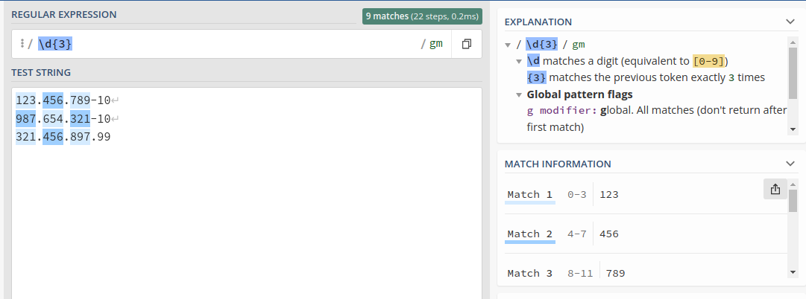
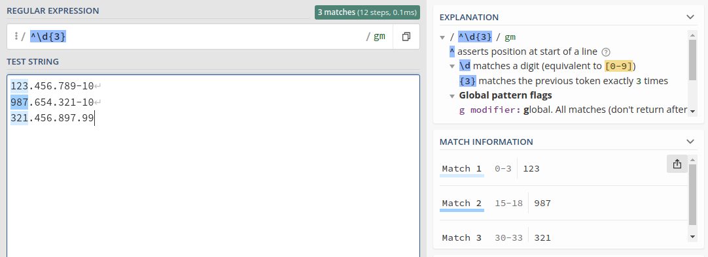
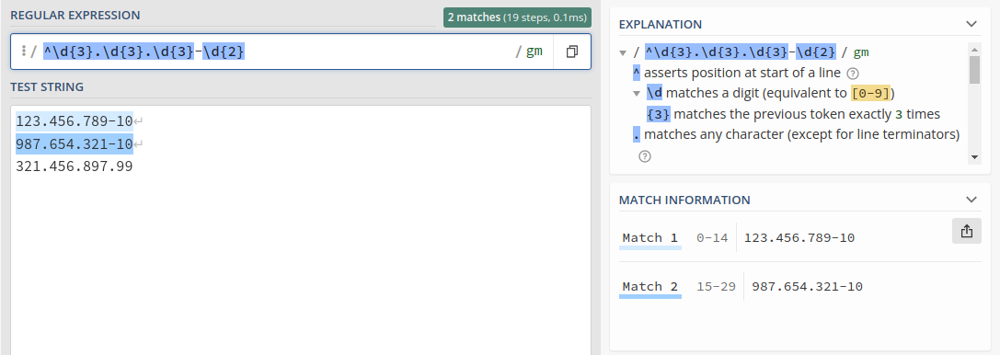
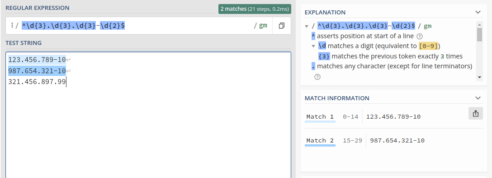

Para buscar por números ou dígitos com regex
podemos usar:
```
\d
```
ou
```
[0-9]
```
A barra invertida `\` indica que é um "comamdo" da regex.
No exemplo abaixo aplicando a expressão `\d`, teremos um _match_ com todos os dígitos.
Mas olhando o exemplo, vemos que temos um padrão, de três dígitos consecutivos. Podemos
dar um _match_ neles usando o `\d{3}`.

```
123.456.789-10
987.654.321-10
321.456.897.99
```



Agora para pegar apenas o início de cada linha, usando o `^`, que indica justamente o ínício da linha que tenha o padrão `\d{3}`.
Repare que os outros foram ignorados.



Para fazer um _match_ completo do padrão do CPF, podemos `^\d{3}.\d{3}.\d{3}-\d{2}`. Nesse caso o `.` está sendo pesquisado de forma
literal.



E como boa prática encerramos o `$`, indicando que expressão termina na linha, evitando processamento desnecessário.



Agora para pesquisar os caracteres especiais `.` e `-`