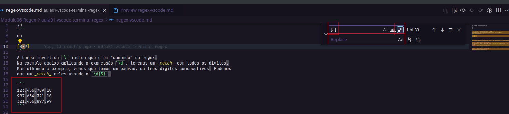
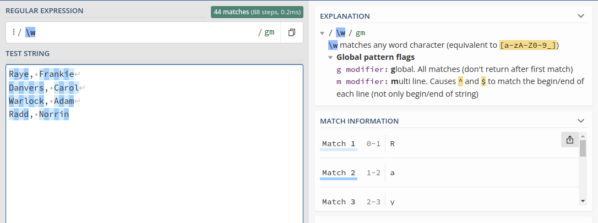
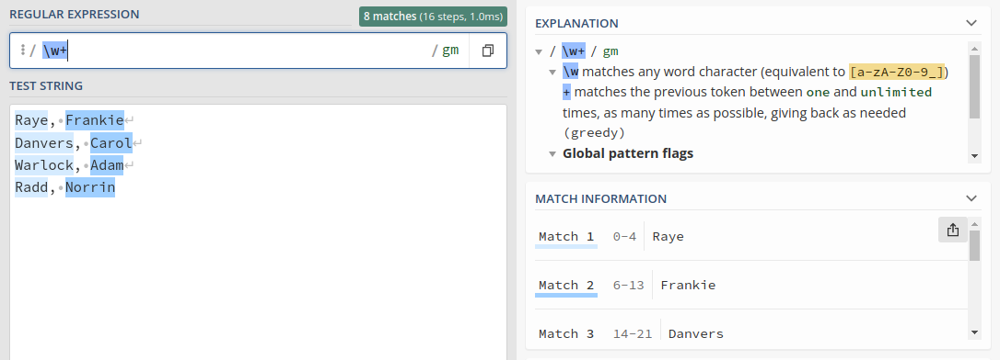
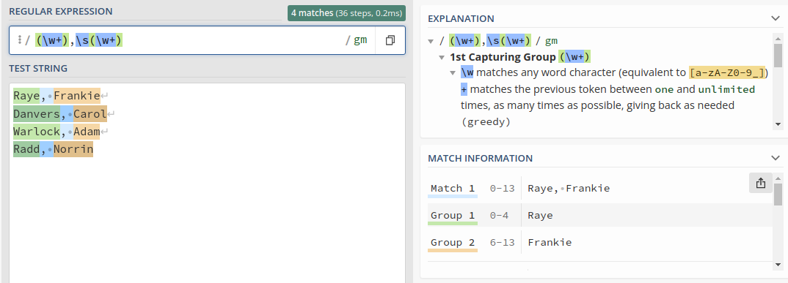
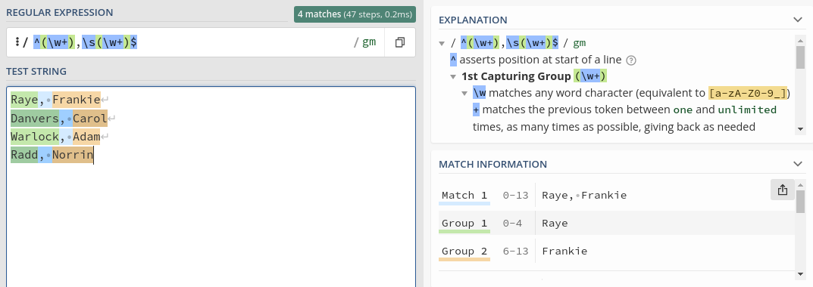
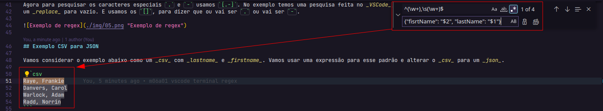
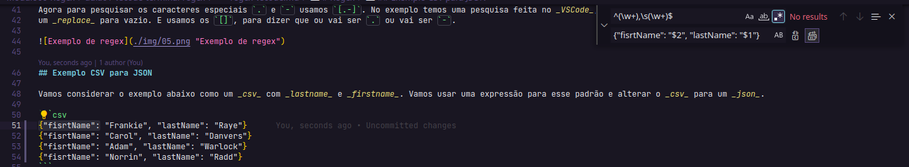
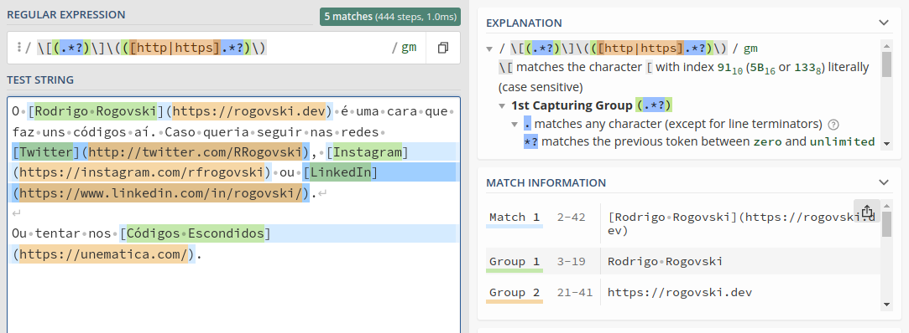
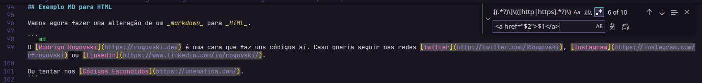
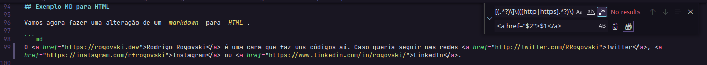

# Regex

## Exemplo de pesquisa por padrões e substuição

Para buscar por números ou dígitos com regex
podemos usar:
```
\d
```
ou
```
[0-9]
```
A barra invertida `\` indica que é um "comamdo" da regex.
No exemplo abaixo aplicando a expressão `\d`, teremos um _match_ com todos os dígitos.
Mas olhando o exemplo, vemos que temos um padrão, de três dígitos consecutivos. Podemos
dar um _match_ neles usando o `\d{3}`.

```
123.456.789-10
987.654.321-10
321.456.897.99
```


Agora para pegar apenas o início de cada linha, usando o `^`, que indica justamente o ínício da linha que tenha o padrão `\d{3}`.
Repare que os outros foram ignorados.


Para fazer um _match_ completo do padrão do CPF, podemos `^\d{3}.\d{3}.\d{3}-\d{2}`. Nesse caso o `.` está sendo pesquisado de forma
literal.


E como boa prática encerramos o `$`, indicando que expressão termina na linha, evitando processamento desnecessário.


Agora para pesquisar os caracteres especiais `.` e `-` usamos `[.-]`. No exemplo temos uma pesquisa feita no _VSCode_, onde poderiamos fazer
um _replace_ para vazio. E usamos os `[]`, para dizer que ou vai ser `.` ou vai ser `-`.



## Exemplo CSV para JSON

Vamos considerar o exemplo abaixo como um _csv_ com _lastname_ e _firstname_. Vamos usar uma expressão para esse padrão e alterar o _csv_ para um _json_.

```csv
{"fisrtName": "Frankie", "lastName": "Raye"}
{"fisrtName": "Carol", "lastName": "Danvers"}
{"fisrtName": "Adam", "lastName": "Warlock"}
{"fisrtName": "Norrin", "lastName": "Radd"}
```
Primeiro vamos tentar entender o padrão. Podemos usar `\w` para pegar cada _word character_ de forma separada. Note que `\w` equivale à `[a-zA-Z0-9_]`.



Mas no nosso exemple queremos pegar a palavra toda. Pdemos usar o `\w+`, assim pegamos todas as letras até chegar em caracter especial.



Mas compor todo o padrão, temos que pegar também a `,` e o espaço em branco seguindo da próxima palavra. Então, incluimos a `,` na nossa expressão e `\s` para incluir o espaço. Caso quiséssemos desconsiderar o espaço poderiamos usar o `\S`, com o S maiúsculo. E para pegar o restante da palavra, basta repetir o `\w+`.


Mas, vamos seprar esses _matches_ por grupos, assim podemos usá-los de forma mais eficiente no nosso _replace_ para _json_.
Para isso, para colocar cada _match_ entre parenteses. A `,` e o espaço não serão necessários para o nosso resultado.



E olhando no _Match Information_ do _regex101_ temos o _Full Match_ que corresponde ao grupo 0, o _Group 1_ e o _Group 2_.

E para manter as boas práticas use `^` no início e o `$` no fim.



Agora com esse padrão vamos para o _VSCode_ e fazer o nosso _replace_. Repare que na pesquisa do _VSCode_ já identificou 4 ocorrências. E agora vamos dar um _replace_ por `{fisrtName: "$2", lastName: "$1"}`, onde o `$2` é o _Group 2_ e o `$1` é o _Group 1_. O `$0` corresponde ao _Full Match_.



E ao executar o _replace_, temos:




```json
{"fisrtName": "Frankie", "lastName": "Raye"}
{"fisrtName": "Carol", "lastName": "Danvers"}
{"fisrtName": "Adam", "lastName": "Warlock"}
{"fisrtName": "Norrin", "lastName": "Radd"}
```
## Exemplo MD para HTML

Vamos agora fazer uma alteração de um _markdown_ para _HTML_.

```md
O [Rodrigo Rogovski](https://rogovski.dev) é uma cara que faz uns códigos aí. Caso queria seguir nas redes [Twitter](http://twitter.com/RRogovski), [Instagram](https://instagram.com/rfrogovski) ou [LinkedIn](https://www.linkedin.com/in/rogovski/).

Ou tentar nos [Códigos Escondidos](https://unematica.com/).
```
Resultado do _md_ acima:

O [Rodrigo Rogovski](https://rogovski.dev) é uma cara que faz uns códigos aí. Caso queria seguir nas redes [Twitter](http://twitter.com/RRogovski), [Instagram](https://instagram.com/rfrogovski) ou [LinkedIn](https://www.linkedin.com/in/rogovski/).

Ou tentar nos [Códigos Escondidos](https://unematica.com/).

Vamos analisar o padrão desse texto. Queromos extrair o título que está entre `[]` e o link que está entre `()`. Para isso vamos fazer uma pesquisa literal com `\` e o caracter que desejamos, nesse caso `[`. Como queremos tudo que está dentro do `[` incial e do `]` final. Usamos `\[(.*)\]`, mas dessa forma ele pega o primeiro e vai até a última ocorrência da linha. E não é o padrão que desejamos.

Para que ele pare o primeiro `]` que seria o que fecha o anterior pode usar o `?` também conhecido como _non-greedy_, assim ele olha até o delimitador `]`. Dessa forma temos o nosso primeiro grupo.

Agora vamos para o nosso _link_ que tem um padrão bem parecido. Mas como `()` são usado para grupos, lembre de usar `\` antes de cada parentese para considerar ele em uma busca literal. Vamos informar para pegar dentro dos `()` para pegar o que começa com _http_ ou _https_, assim temos o padrão `\(([http|https].*?)\)`.



Agora com o padrão `\[(.*?)\]\(([http|https].*?)\)`, podemos fazer um _replace_ no _VSCode_.






Assim teremos o _replace_ para:

```html
O <a href="https://rogovski.dev">Rodrigo Rogovski</a> é uma cara que faz uns códigos aí. Caso queria seguir nas redes <a href="http://twitter.com/RRogovski">Twitter</a>, <a href="https://instagram.com/rfrogovski">Instagram</a> ou <a href="https://www.linkedin.com/in/rogovski/">LinkedIn</a>.

Ou tentar nos <a href="https://unematica.com/">Códigos Escondidos</a>.
```

## Regex no terminal

Para esse exemplo, vamos considerar o diretório raiz desse projeto, vamos pesquisar todos os arquivos que tiveram `.test.js`. Vamos o comando:

```bash
find . -name *.test.js
```
Mas usando o comando dessa forma, foi listado também coisas da _node\_modules_, para ignorar esse diretório:

```bash
find . -name *.test.js -not -path '*node_modules**'
```
Onde, usando as opções `-not -path` informamos para ignorar tudo o que contiver _node\_modules_ usando `*node_modules` e colando os `**` para ignorar também os arquivos dentro desse diretório.

Vamos buscar agora todos os arquivos `.js`.

```bash
find . -name *.js -not -path '*node_modules**'
```

E vamos usar uma biblioteca _node_ chamada _ipt_. Fazendo a instalação global com:

```bash
npm i -g ipt
```

Com o _ipt_ instalado, vamos fazer o _find_ novamente e passar o resultado dessa pesquisa para o _ipt_.

```bash
find . -name *.js -not -path '*node_modules**' | ipt
```
Dessa forma, demos um painel iterativo onde podemos selecionar os arquivo que desejamos. Onde o _find_ passa pelo _pipe_ `|` o _array_ de _bytes_ que forem chegando vão sendo passados para o _ipt_.

Agora para o próximo exemplo, vamos usar os arquivos do _Modulo02-Javascript Testing/aula05-tdd-project-pt03_. Fazendo uma cópia para o nosso exemplo.

```bash
cp -r ../../Modulo02-Javascript\ Testing/aula05-tdd-project-pt03 .
```
Como esses arquivos não usam `'use strict';`, vamos incluí-lo em todos os arquivos do nosso projeto.

Então vamos inserir nesses arquivos o conteúdo `'use strict';`. Com _ipt_ usando a opção `-o` para selecionar múltiplos arquivos. Também vamos utilizar o `xargs` para que execute um determinado comando para cada arquivos for retornado do `find`. Então para cada arquivo selecionado do _ipt_, vamos armazenar a informação em uma variável `{file}` e simplesmente dar um `echo` concatenado com a _string_ `'Selecionado => '` com a variável `{file}`. Para testarmos o nosso padrão.

```bash
CONTENT="'use strict';"
find . -name *.js -not -path '*node_modules**' \
| ipt -o \
| xargs -I '{file}' echo 'Selecionado => ' {file}
```
Agora vamos para o nosso caso de substituição, ou melhor, incluir o `'use strict';`. Para isso vamos usar o `sed` _stream editor for filtering and transforming text_ ([SED Comandos](http://sed.sourceforge.net/sed1line_pt-BR.html) e [SED Comandos+](https://gist.github.com/lamb-mei/60b98e044bfff667165f77c995ed72bd)) com as opções `-i` para editar o arquivo e o `""` seria um sufixo para mander os arquivos originais e criar novos arquivos com o nome anterior junto com esse sufixo. E o `-e` recebe a nossa expressão, que será `'1s/^/\'$CONTENT'\`, na primeira linha `1s` no seu início `/^`, inserior o `/\'$CONTENT'\` conteúdo que criamos com o `CONTENT` e para quebrar a linha, vamos simular um `\n` com `/g` e por fim inserir o conteúdo do _stream_ da variável `{file}`.


Primeira tentiva do comando no Ubuntu 20.04.3 LTS x86_64, apresenta erro:

```bash
CONTENT="'use strict';"
find . -name *.js -not -path '*node_modules**' \
| ipt -o \
| xargs -I '{file}' sed -i "" -e '1s/^/\'"$CONTENT"'\
/g' {file}
```

Solução:

```bash
CONTENT="'use strict';"
find . -name *.js -not -path '*node_modules**' \
| ipt -o \
| xargs -I '{file}' sed -i {file} -e '1s/^/\'"$CONTENT"'\n\n/g'
```
Para executar em todos os arquivos em o uso do _ipt_:

```bash
CONTENT="'use strict';"
find . -name *.js -not -path '*node_modules**' \
| xargs -I '{file}' sed -i {file} -e '1s/^/\'"$CONTENT"'\n\n/g'
```