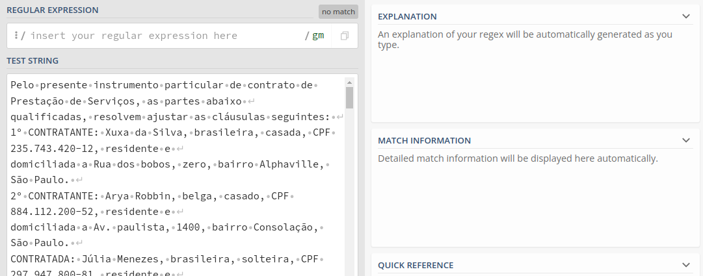
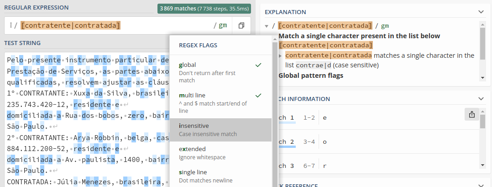
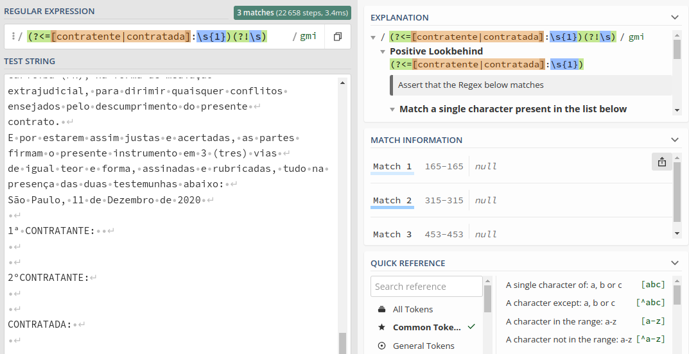
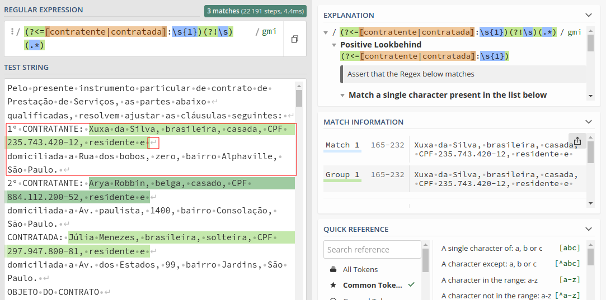
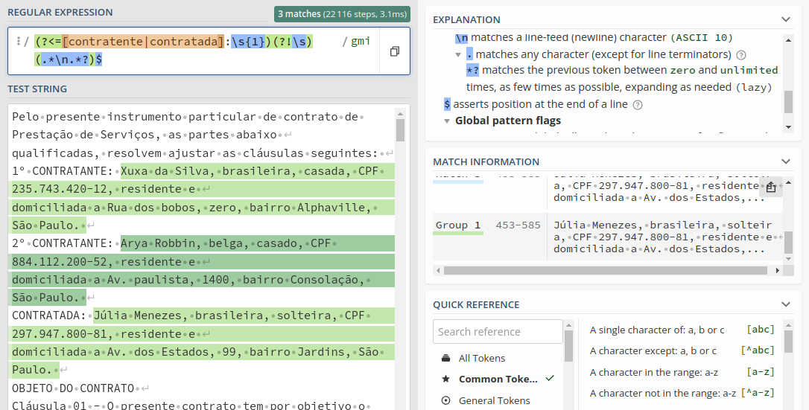

# Regex - Fluent API

## Extraindo dados de um PDF para usar como Mock

Nesse projeto vamos usar a lib _node_ _pdf-parse_ para que possamos extrair as informações do _array_ de _bytes_ do arquivo _PDF_ usado com exemplo.

E vamos coletar o texto para usar como um _mock_, para isso, temos o arquivo `./src/index.js`, incialmente nesse estado, pois mais a frente iremos alterá-lo.

```javascript
'use strict';

const { readFile } = require('fs/promises');
const { join } = require('path');
const pdf = require('pdf-parse');

(async() => {
    const dataBuffer = await readFile(join(__dirname, './../docs/contrato.pdf'));
    const data = await pdf(dataBuffer);
    console.log(data.text);

})()
```

E dessa forma, podemos usar o _output_ gerado e popular um arquivo `.txt` usando o comando:

```bash
npm start | tee ./docs/text.txt
```

Dessa forma será criado um arquivo `text.txt` no diretório `docs`, abra o arquivo e remova as linhas iniciais que são o _output_ do _node_ e ficarmos apenar com o foi locado pelo `console.log()`.

Agora vamos usar esse texto no [Regex101](https://regex101.com/) para analisar o padrão que desejamos para fazer extração de dados.



Nossa intenção é extrair os dados do contratente/contratada. E como podemos obersavar, nesse documento essas informações estão sempre a frente das palavras `contratante` ou `contratada`.

Podemos usar a expressão `[contratente|contratada]` com a _flag_ `i` (_case insensitive_).



Refinando a nossa expressão, vamos incluir tudo o que estiver depois das palavras contratente ou contratada, seguidos por `:` e UM espaço em branco `\s{1}`. Mas como desejamos o conteúdo que estiver a frente dessa expressão. Vamos colocá-la em um grupo e usar a condição [Positive Lookbehind](https://javascript.info/regexp-lookahead-lookbehind), `(?<=Y)X`, corresponde a `X`, mas somente se houver `Y` antes dele.

E para não considerar o contratente ou contradata que no final do texto, não tem nada a frente, podemos colocar mais um grupo com uma condição `(?!\s)`. Assim o contratente ou contradata que tiver mais de um espaço a frente, vai ser ignorado.



E agora para pegar o conteúdo a frente dessa expressão, vamos criar o grupo `(.*)` que irá pegar tudo. Mas perceba que não foi até o final. Pois temos uma quebra de linha depois do "e".



Para solucionar isso, podemos incluir a quebra de linha `\n` e tudo que vier depois dela. Assim temos `(.*\n.*)`, agora temos o _match_ desejamos. E para finalizar a nossa expressão podemos fechar o `$`. Mas nesse exemplo não colocamos o `^` no início, pois as palavras contratante e contratada não estão no início da frase.

E ainda podemos colocar `?` para que pare na primeira expressão que tiver, que é a mesma lógica do exemplo anterior de pegar os _links_, assim temos `(.*\n.*?)`.

Assim nossa expressão completa fica, `(?<=[contratente|contratada]:\s{1})(?!\s)(.*\n.*?)$`.



## Fluent API

Agora iremos usar o padrão _Fluent API_ para consumir os dados 

Em analogia com o padrão [Builder](https://jsmanifest.com/the-builder-pattern-in-javascript/), onde é muito usado para construir objetos do qual não temos todas as informações no momento em que criamos uma instância, ou não temos todos os dados para passar para construtor. Onde, por exemplo, umas instância de uma classe `Usuario`, poderiamos ir setando os valores da forma:

```javascript
const usuario = new Usuario();
usuario.setName('Norrin Radd')
.setHero('Silver Surfer')
.setPower('Cosmic')
.build();
```
Agora no caso do _Fluent API_ é que ele não é para criar o objeto. Ele processa os dados de forma ordenada.

>Quando falamos no contexto de engenharia de software, uma fluent API é uma API orientada a objetos cujo design se baseia amplamente no encadeamento de métodos. 

>Esse conceito, que foi criado em 2005 por Eric Evans e Martin Fowler, tem por objetivo aumentar a legibilidade do código criando uma linguagem específica de domínio (DSL). 

>Na prática, criar uma API fluente significa desenvolver uma API em que não é necessário memorizar os próximos passos ou métodos, permitindo que haja uma sequência natural e contínua como se fosse um menu de opções.

>Essa cadência natural funciona de forma semelhante a um restaurante ou mesmo uma rede fast food em que à medida que você está montando um prato, as opções variam de acordo com as escolhas que você for fazendo. Se, por exemplo, você optar por um sanduíche de frango, os acompanhamentos serão sugeridos considerando o prato escolhido e assim por diante.

[O que é uma Fluent API, ou API fluente?](https://www.zup.com.br/blog/fluent-api)

Para saber mais sobre o [Fluent API](https://www.youtube.com/watch?v=Gvamncn_wG0)

O Objetivo do _Fluent API_ é executar tarefas como um pipeline, _step by step_ e no fim, chama o build. Muito similar ao padrão _Builder_. A diferença é que aqui é sobre processos, o _Builder_ sobre construção de objetos.