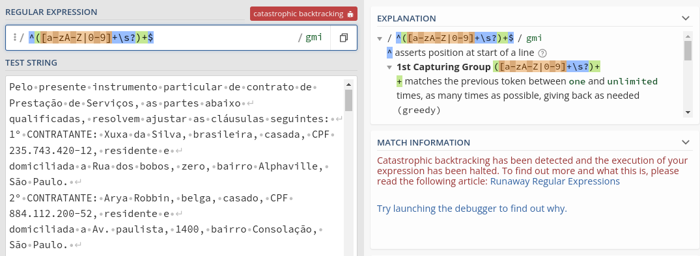

# Regex - Segurança

## Validação de expressões

[Artigo Base](https://lirantal.medium.com/node-js-pitfalls-how-a-regex-can-bring-your-system-down-cbf1dc6c4e02)

```javascript
^([a-zA-Z|0-9]+\s?)+$
```

